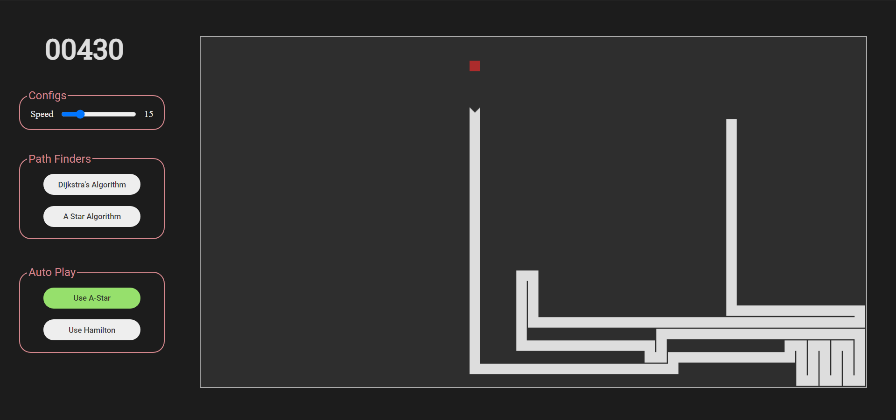

<div align="center">

<h1>Algo Snake</h1>

<p>
  <strong>A website where you can play snake game and Visualize Path Finding Algorithms</strong>
  <br /><br />
  Live Project Link: 
  <a href="https://wandering-sage.github.io/algo-snake/">https://wandering-sage.github.io/algo-snake/</a>
</p>


<p>
  <sub>Made with ❤︎ by
    <a href="https://github.com/wandering-sage">Shivam Kumar</a>
  </sub>
</p>
</div>


## Project in Action




### Getting Started:

- Clone, unzip and navigate to the project directory in your terinal.

```bash
git clone https://github.com/wandering-sage/algo-snake.git
cd algo-snake
```

- To install dev dependencies, type the following command in your terminal.

```bash
npm install
```

- Type npm start to start a dev server.

```bash
npm start
```

- The dev server will be running at [http://127.0.0.1:3000/](http://127.0.0.1:3000/)
- Type npm run build to make bundle for production.

```bash
npm run build
```

### How to use:

- Launch the [website](https://wandering-sage.github.io/algo-snake/).
- You can use the arrow or wasd keys to change the direction of the snake.
- You can pause the game at any state by pressing the Spacebar key.
- To visualize a pathfinding algo:
  - pause the game
  - then click the algorithm you want to visualize.
- To use Auto-play just click the button in a running game.


### Description:

- This is a website where you can play snake game and Visualize Path Finding Algorithms.
- Used JavaScript, Webpack, ES6 modules, and HTML canvas to implement this project.
- Implemented Dijkstra’s Algorithm, A-star as visualizations.
- Also implemented the functionality to Auto-play using Hamilton-cycle and A-star.
- User can alter the game's speed using the speed slider.


